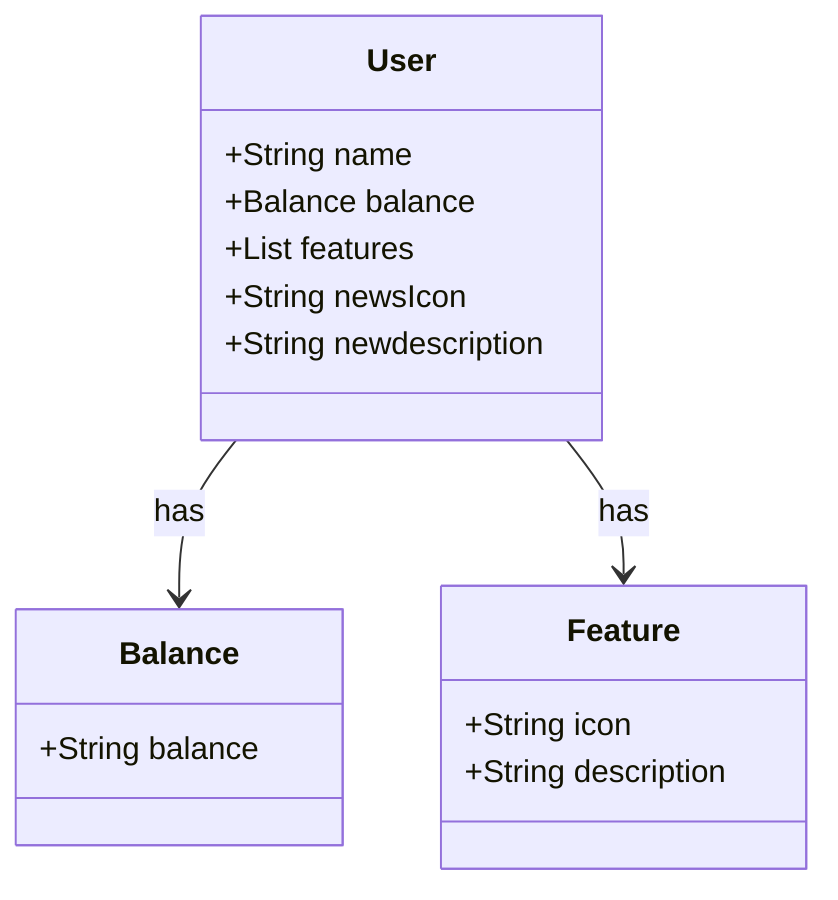

# Publicando Sua API REST na Nuvem Usando Spring Boot 3, Java 17 e Railway

Vamos mergulhar diretamente no universo do desenvolvimento e construir uma API REST do zero! E o melhor de tudo, faremos isso utilizando o Java 17, a versão LTS mais recente que está recheada de novidades empolgantes. Para tornar a nossa jornada ainda mais produtiva, vamos empregar o poder do Spring Boot 3, que é amplamente conhecido por potencializar a produtividade dos desenvolvedores através de sua incrível capacidade de autoconfiguração. Mas não para por aí, vamos simplificar ainda mais o acesso aos bancos de dados SQL com o auxílio do Spring Data JPA. Durante nosso percurso, também vamos tratar da importância de uma documentação de API bem construída e fácil de compreender, para isso, vamos usar o OpenAPI, também conhecido como Swagger. Para finalizar nosso projeto, vamos usar o Railway, uma plataforma que torna o Deploy de soluções na nuvem muito mais simples. Assim, podemos nos concentrar no que realmente importa: o desenvolvimento das nossas soluções!

**Spring | REST | SQL | PostgreSQL | Railway | Full-Stack | Avançado

## Desafio

Já dominamos o universo do desenvolvimento e construímos uma API REST utilizando o Java 17, a versão LTS mais recente repleta de novidades. Com o poder do Spring Boot 3, otimizamos nossa produtividade graças à sua habilidade de autoconfiguração. Além disso, facilitamos o acesso aos bancos de dados SQL com o auxílio do Spring Data JPA. Também destacamos a importância de uma documentação de API robusta e clara, utilizando o OpenAPI, ou Swagger. E com o Railway, simplificamos o Deploy de nossas soluções na nuvem. Agora, é hora de embarcar em um novo desafio e explorar um domínio de aplicação diferente, mantendo nosso foco em inovar e desenvolver soluções de alto padrão!

## [**Link Figma**](https://www.figma.com/design/PTY4FETHUt0twyCyReemBL/Bradesco-bootcamp?node-id=0-1&t=sezpCYgovS44iV4g-1)

O Figma foi utilizado para a abstração do domínio desta API, sendo útil na análise e projeto da solução.

## Diagrama de Classe (Domínio da API)

##

Projeto desenvolvido durante o [**Bootcamp Bradesco - Java Cloud Native**](https://www.dio.me/bootcamp/bradesco-java-cloud-native), fornecido pela [**DIO**](https://www.dio.me/)

##

- [By Páucinha](https://github.com/Paucinha)
