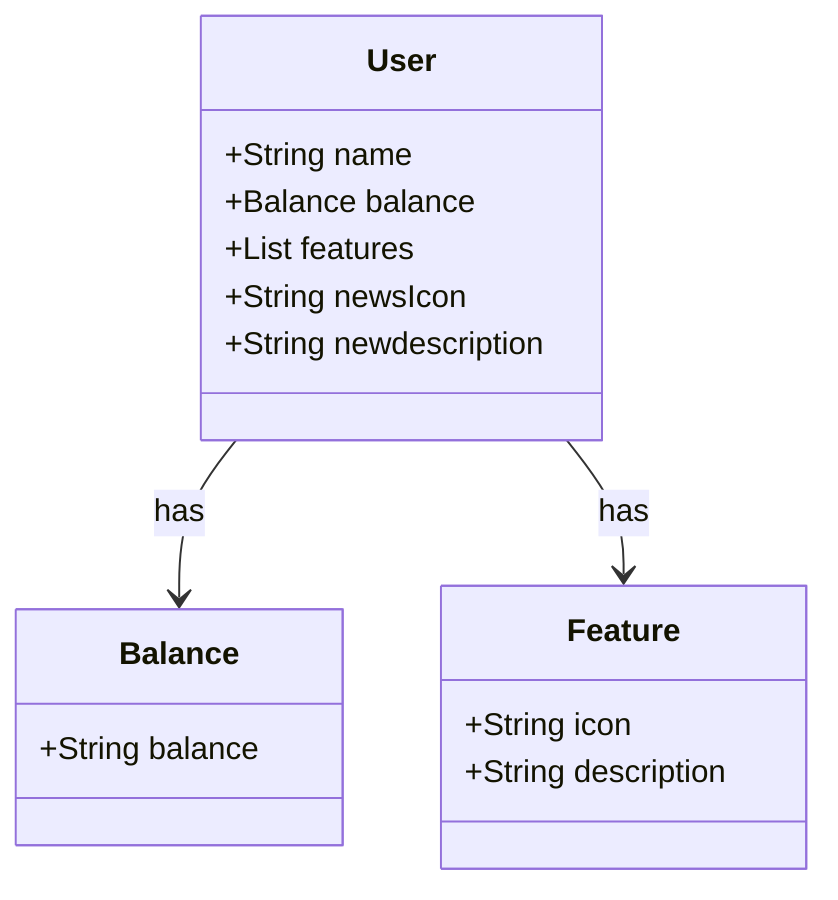

#

## Diagrama de Classe

```mermaid
classDiagram
    class User {
        +String name
        +Balance balance
        +List<Feature> features
        +String newsIcon
        +String newdescription
    }

    class Balance {
        +String balance
    }

    class Feature {
        +String icon
        +String description
    }

    User --> Balance : has
    User --> Feature : has
```

